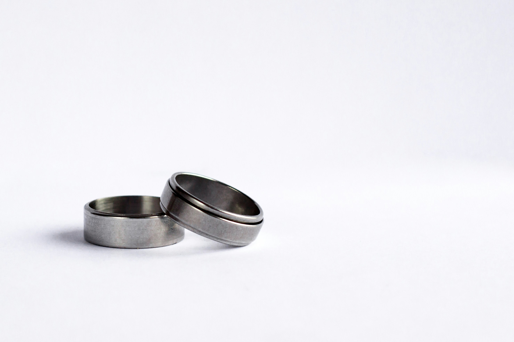

# Maßgeschneiderte Produkte dank 3D-Druck: Wie Individualisierung die Zukunft des Konsums prägt

Der 3D-Druck hat in den letzten Jahren einen enormen Einfluss auf die Art und Weise, wie Produkte hergestellt und konsumiert werden. Die Fähigkeit, maßgeschneiderte Produkte direkt nach den individuellen Bedürfnissen der Kunden zu fertigen, revolutioniert nicht nur die Fertigung, sondern auch den Konsum selbst. In diesem Artikel werfen wir einen detaillierten Blick darauf, wie der 3D-Druck die Individualisierung vorantreibt und die Zukunft des Konsums prägt.

## 1. Die Bedeutung der Individualisierung im modernen Konsum

In einer Zeit, in der Massenproduktion und Standardisierung dominieren, wächst der Wunsch der Verbraucher nach Individualität. Kunden suchen zunehmend nach Produkten, die ihren persönlichen Vorlieben und Bedürfnissen entsprechen, anstatt sich mit "Einheitslösungen" zufriedenzugeben. Hier kommt der 3D-Druck ins Spiel, der es ermöglicht, Produkte nach Maß zu fertigen, ohne die hohen Kosten und den Aufwand traditioneller Fertigungsmethoden.

### Vorteile der Individualisierung durch 3D-Druck:

- **Perfekte Passform:** Produkte können genau auf die Maße und Anforderungen des Kunden abgestimmt werden.
- **Exklusivität:** Maßgeschneiderte Produkte bieten ein einzigartiges Erlebnis und heben sich von der Masse ab.
- **Schnellere Markteinführung:** Unternehmen können schneller auf Kundenwünsche reagieren und neue Designs ohne lange Vorlaufzeiten anbieten.

## 2. Anwendungsbereiche der maßgeschneiderten Fertigung

Der 3D-Druck ermöglicht eine breite Palette von Anwendungen, bei denen maßgeschneiderte Produkte im Vordergrund stehen. Hier sind einige Beispiele:

### Mode und Schmuck

Im Mode- und Schmuckbereich ermöglicht der 3D-Druck die Fertigung von maßgeschneiderten Accessoires, die perfekt auf den Stil und die Vorlieben des Trägers abgestimmt sind. Von individuell gestalteten Ringen bis hin zu maßgeschneiderten Schuhen – die Möglichkeiten sind nahezu unbegrenzt.

_Ein maßgeschneiderter 3D-gedruckter Ring, der individuell für den Träger gestaltet wurde._

### Medizintechnik

In der Medizintechnik wird der 3D-Druck genutzt, um maßgeschneiderte Implantate, Prothesen und Orthesen herzustellen, die genau auf die anatomischen Gegebenheiten des Patienten abgestimmt sind. Dies führt zu besseren Behandlungsergebnissen und erhöhtem Komfort für den Patienten.

### Möbel und Innenausstattung

Der 3D-Druck revolutioniert auch die Innenarchitektur, indem er es ermöglicht, Möbelstücke und Dekorationselemente nach den genauen Wünschen des Kunden zu fertigen. Ob es sich um einen maßgeschneiderten Stuhl oder eine individuell gestaltete Lampe handelt – der 3D-Druck macht es möglich.

### Automobilindustrie

In der Automobilindustrie können maßgeschneiderte Bauteile und Zubehörteile für spezifische Fahrzeuge oder individuelle Kundenwünsche gedruckt werden. Dies reicht von speziellen Halterungen bis hin zu personalisierten Innenraumelementen.

## 3. Der Prozess der Individualisierung durch 3D-Druck

Die Individualisierung von Produkten durch 3D-Druck folgt einem klar strukturierten Prozess, der es ermöglicht, maßgeschneiderte Produkte schnell und effizient zu fertigen.

### Schritte im Individualisierungsprozess:

1. **Designphase:** Der Kunde gibt seine spezifischen Anforderungen an das Produkt an, z. B. Maße, Formen oder besondere Funktionen. Das Design wird in einer CAD-Software erstellt.
2. **Prototyping:** Ein erster Prototyp des Produkts wird gedruckt, um sicherzustellen, dass es den Anforderungen entspricht. Anpassungen können in dieser Phase vorgenommen werden.
3. **Fertigung:** Sobald das Design finalisiert ist, wird das Produkt in der gewünschten Stückzahl gedruckt.
4. **Lieferung:** Das fertige, maßgeschneiderte Produkt wird an den Kunden geliefert.

## 4. Herausforderungen und Chancen der maßgeschneiderten Fertigung

Während der 3D-Druck immense Möglichkeiten für die Individualisierung bietet, gibt es auch Herausforderungen, die es zu bewältigen gilt.

### Herausforderungen:

- **Kosten:** Maßgeschneiderte Produkte sind in der Regel teurer als Massenware, was sie für einige Kunden weniger attraktiv machen könnte.
- **Technologische Grenzen:** Trotz der Fortschritte im 3D-Druck gibt es noch Material- und Technologiegrenzen, die bestimmte Designs oder Anwendungen einschränken können.
- **Skalierbarkeit:** Die Herstellung maßgeschneiderter Produkte ist oft zeitaufwändiger, was die Produktion in größeren Stückzahlen herausfordernd macht.

### Chancen:

- **Kundenbindung:** Unternehmen, die maßgeschneiderte Produkte anbieten, können eine stärkere Bindung zu ihren Kunden aufbauen, da diese die Produkte als einzigartig und wertvoll wahrnehmen.
- **Innovationspotenzial:** Der 3D-Druck fördert Innovationen, da neue Designs und Produkte schnell entwickelt und getestet werden können.
- **Umweltfreundlichkeit:** Maßgeschneiderte Produkte können Ressourcen schonen, da nur die benötigte Menge an Material verwendet wird und weniger Abfall entsteht.

## 5. Die Zukunft des Konsums: Maßgeschneiderte Produkte als Standard

Die Entwicklung des 3D-Drucks wird dazu führen, dass maßgeschneiderte Produkte zunehmend zur Norm werden. Unternehmen, die frühzeitig auf diese Technologie setzen, werden in der Lage sein, ihren Kunden einzigartige Produkte anzubieten und sich in einem wettbewerbsintensiven Markt zu differenzieren.

### Fazit: Maßgeschneiderte Produkte als Schlüssel zur Zukunft des Konsums

Der 3D-Druck verändert die Art und Weise, wie wir Produkte konsumieren und erleben. Durch die Möglichkeit, maßgeschneiderte Produkte nach den individuellen Bedürfnissen der Kunden zu fertigen, eröffnet sich eine neue Ära des Konsums. Unternehmen, die diese Technologie nutzen, werden in der Lage sein, ihren Kunden ein unvergleichliches Maß an Individualisierung und Exklusivität zu bieten.

**Bereit, die Vorteile des 3D-Drucks zu nutzen?** [Kontaktieren Sie uns](/kontakt), um mehr darüber zu erfahren, wie wir Ihnen helfen können, maßgeschneiderte Produkte für Ihre Kunden zu entwickeln!
