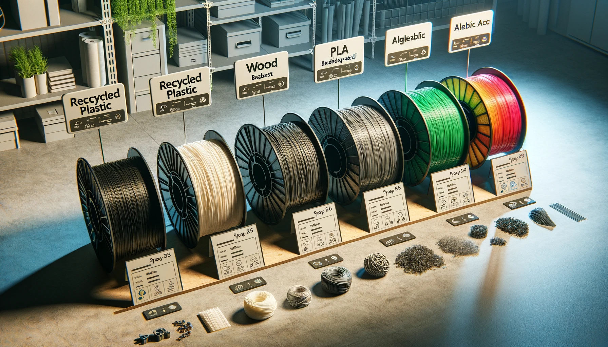

# 3D-Druck und Nachhaltigkeit: Wie umweltfreundlich ist additive Fertigung wirklich?

Der 3D-Druck, auch als additive Fertigung bekannt, hat das Potenzial, die Art und Weise, wie wir Produkte herstellen, zu revolutionieren. Doch wie umweltfreundlich ist diese Technologie wirklich? In diesem Artikel werfen wir einen detaillierten Blick auf die Nachhaltigkeitsaspekte des 3D-Drucks, die ökologischen Vorteile und die Herausforderungen, die es zu bewältigen gilt.

## 1. Was macht den 3D-Druck nachhaltig?

Einer der größten Vorteile des 3D-Drucks ist seine Fähigkeit, Materialabfall zu minimieren. Im Gegensatz zu traditionellen Fertigungsmethoden, bei denen Material durch Schneiden, Bohren oder Fräsen entfernt wird (subtraktive Fertigung), fügt der 3D-Druck Material nur dort hinzu, wo es benötigt wird. Dies führt zu einer erheblichen Reduzierung des Materialverbrauchs.

### Vorteile des 3D-Drucks in Bezug auf Nachhaltigkeit:

- **Weniger Materialabfall:** Der 3D-Druck verwendet nur das Material, das für das Objekt erforderlich ist, was zu weniger Abfall führt.
- **Dezentrale Produktion:** Produkte können direkt vor Ort hergestellt werden, was Transportkosten und den damit verbundenen CO₂-Ausstoß reduziert.
- **Langlebigkeit und Reparatur:** Der 3D-Druck ermöglicht die einfache Herstellung von Ersatzteilen, was die Lebensdauer von Produkten verlängert und den Bedarf an Neukäufen reduziert.

## 2. Herausforderungen der Nachhaltigkeit im 3D-Druck

Trotz seiner Vorteile steht der 3D-Druck vor einigen Herausforderungen, wenn es um Nachhaltigkeit geht. Diese beziehen sich hauptsächlich auf die Materialien, den Energieverbrauch und die Entsorgung von Abfällen.

### Materialherkunft und Recycling:

- **Nicht erneuerbare Materialien:** Viele 3D-Druckmaterialien, wie ABS und PLA, basieren auf petrochemischen Produkten. Obwohl PLA biologisch abbaubar ist, ist es dennoch auf landwirtschaftliche Rohstoffe angewiesen.
- **Recycling von 3D-Druck-Abfällen:** Während der 3D-Druck weniger Abfall erzeugt, stellt die Entsorgung und das Recycling von nicht verwendeten oder fehlerhaften Drucken ein Problem dar. Es gibt jedoch Initiativen, die sich auf die Wiederverwendung und das Recycling von 3D-Druckmaterialien konzentrieren.

### Energieverbrauch:

Der Energieverbrauch beim 3D-Druck kann je nach Technologie und Druckgröße hoch sein. Insbesondere das Schmelzen und Extrudieren von Kunststofffilamenten erfordert erhebliche Mengen an Energie.

### Beispiel für Energieverbrauch:

| Technologie | Typischer Energieverbrauch |
| ----------- | -------------------------- |
| **FDM**     | Mittel (200-500 W)         |
| **SLA**     | Hoch (400-800 W)           |
| **SLS**     | Sehr hoch (1000+ W)        |

## 3. Nachhaltige Materialien im 3D-Druck

Die Wahl des richtigen Materials ist entscheidend für die ökologische Bilanz eines 3D-Druckprojekts. Es gibt zunehmend nachhaltige Alternativen zu traditionellen Filamenten, die aus recycelten oder biologisch abbaubaren Quellen hergestellt werden.

### Beispiele für nachhaltige Materialien:

- **PLA (Polylactide):** PLA wird aus nachwachsenden Rohstoffen wie Maisstärke hergestellt und ist biologisch abbaubar. Es ist eines der umweltfreundlichsten Filamente auf dem Markt.
- **Recyceltes PETG:** PETG ist ein haltbares Material, das oft aus recycelten Kunststoffflaschen hergestellt wird, was seine Umweltbilanz verbessert.
- **Bio-Komposite:** Diese Materialien bestehen aus einer Mischung aus PLA und natürlichen Fasern wie Holz oder Bambus, was sie sowohl ästhetisch ansprechend als auch umweltfreundlich macht.

## 4. Ökologische Auswirkungen und Lebenszyklusanalyse

Um die Umweltfreundlichkeit des 3D-Drucks vollständig zu verstehen, ist es wichtig, eine Lebenszyklusanalyse (LCA) durchzuführen. Diese Analyse bewertet die ökologischen Auswirkungen eines Produkts von der Rohstoffgewinnung über die Herstellung bis hin zur Nutzung und Entsorgung.

### Schritte einer Lebenszyklusanalyse im 3D-Druck:

1. **Rohstoffgewinnung:** Bewertung der Umweltauswirkungen der Materialien, die für den 3D-Druck verwendet werden.
2. **Herstellung:** Analyse des Energieverbrauchs und der Emissionen während des Druckprozesses.
3. **Nutzung:** Untersuchung der Haltbarkeit und Reparaturfähigkeit des gedruckten Objekts.
4. **Entsorgung:** Bewertung der Möglichkeiten zur Wiederverwendung, Recycling oder sicheren Entsorgung des Materials.

## 5. Möglichkeiten zur Verbesserung der Nachhaltigkeit im 3D-Druck

Um den 3D-Druck nachhaltiger zu gestalten, sind verschiedene Maßnahmen und Ansätze erforderlich, die sowohl auf technologischer als auch auf praktischer Ebene umgesetzt werden können.

### Tipps zur Verbesserung der Nachhaltigkeit:

- **Verwendung von nachhaltigen Materialien:** Setzen Sie auf biologisch abbaubare oder recycelte Filamente, um die Umweltauswirkungen zu reduzieren.
- **Optimierung der Druckparameter:** Reduzieren Sie den Energieverbrauch, indem Sie Druckparameter wie Temperatur und Geschwindigkeit optimieren.
- **Recycling und Wiederverwendung:** Nutzen Sie Programme zur Wiederverwertung von Filamentresten und fehlerhaften Drucken.

_Verschiedene nachhaltige 3D-Druck-Filamente, die aus recycelten und biologisch abbaubaren Materialien bestehen._

## Fazit: Wie umweltfreundlich ist der 3D-Druck wirklich?

Der 3D-Druck bietet erhebliche Vorteile in Bezug auf Nachhaltigkeit, insbesondere durch die Reduzierung von Materialabfällen und die Möglichkeit zur dezentralen Produktion. Allerdings gibt es auch Herausforderungen, insbesondere in Bezug auf den Energieverbrauch und die Materialherkunft. Durch die Wahl nachhaltiger Materialien, die Optimierung von Druckprozessen und das Recycling von Abfällen kann die ökologische Bilanz des 3D-Drucks weiter verbessert werden.
