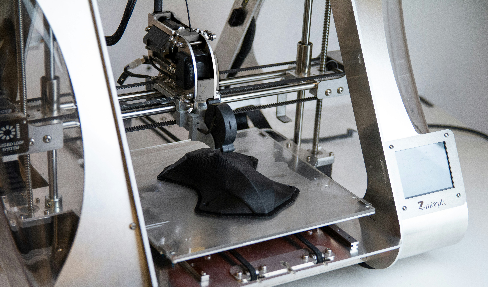
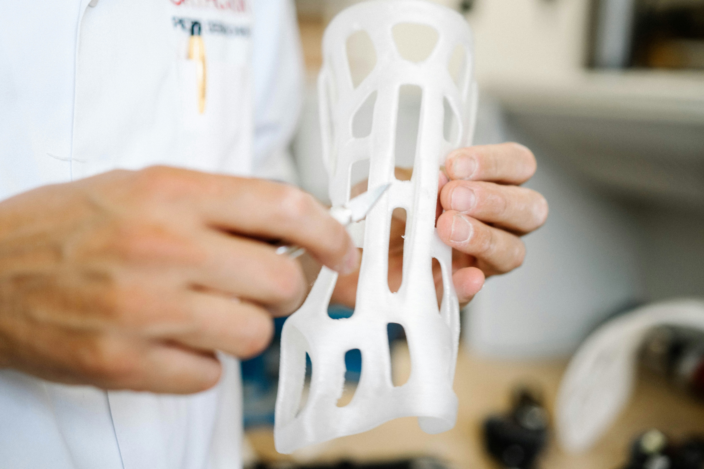

# Warum 3D-Druck die Zukunft der Fertigung ist: Ein Blick auf Industrie 4.0

In den letzten Jahren hat der 3D-Druck eine rasante Entwicklung durchlaufen und ist zu einer der vielversprechendsten Technologien der Industrie 4.0 geworden. Diese vierte industrielle Revolution steht für die intelligente Vernetzung von Maschinen und Prozessen mithilfe moderner Informations- und Kommunikationstechnologien. Der 3D-Druck, auch als additive Fertigung bekannt, spielt in dieser Transformation eine zentrale Rolle. In diesem Artikel beleuchten wir, warum 3D-Druck die Zukunft der Fertigung ist und wie er die Industrie revolutioniert.

## 1. Was ist Industrie 4.0?

Industrie 4.0 bezeichnet den aktuellen Trend zur Automatisierung und Datenverarbeitung in der Fertigung. Es geht darum, physische Produktionssysteme mit digitalen Technologien zu integrieren, um intelligentere, effizientere und flexiblere Produktionsprozesse zu schaffen.

### Die vier Phasen der industriellen Revolution:

1. **Industrie 1.0:** Mechanisierung durch Wasser- und Dampfkraft.
2. **Industrie 2.0:** Massenproduktion durch Elektrizität und Fließbänder.
3. **Industrie 3.0:** Automatisierung durch Elektronik und Computer.
4. **Industrie 4.0:** Vernetzung und Digitalisierung durch IoT, KI und Cyber-Physical Systems.

## 2. Die Rolle des 3D-Drucks in Industrie 4.0

Der 3D-Druck ermöglicht es, komplexe und individuelle Bauteile direkt aus digitalen Modellen herzustellen, ohne dass Werkzeuge oder Formen benötigt werden. Diese Fähigkeit macht den 3D-Druck zu einer Schlüsseltechnologie der Industrie 4.0, die die Art und Weise, wie Produkte entwickelt und produziert werden, grundlegend verändert.

### Vorteile des 3D-Drucks in der Industrie:

- **Flexibilität:** 3D-Druck ermöglicht es, Designs schnell zu ändern und anzupassen, was die Produktentwicklung beschleunigt.
- **Kosteneffizienz:** Da keine speziellen Werkzeuge oder Formen benötigt werden, können auch kleine Stückzahlen kostengünstig produziert werden.
- **Individualisierung:** Der 3D-Druck erlaubt die Fertigung maßgeschneiderter Produkte, die genau auf die Bedürfnisse der Kunden abgestimmt sind.
- **Reduzierter Materialverbrauch:** Additive Fertigung verbraucht nur das Material, das tatsächlich benötigt wird, was Abfall reduziert und die Ressourceneffizienz erhöht.

## 3. Anwendungen des 3D-Drucks in der Industrie

Der 3D-Druck wird in einer Vielzahl von Branchen eingesetzt, von der Automobilindustrie über die Luft- und Raumfahrt bis hin zur Medizin. Hier sind einige Beispiele, wie der 3D-Druck die industrielle Fertigung verändert:

### Automobilindustrie

Die Automobilindustrie nutzt den 3D-Druck zur Herstellung von Prototypen, Werkzeugen und sogar Endbauteilen. Durch die schnelle Iteration von Prototypen können Automobilhersteller ihre Entwicklungszyklen verkürzen und neue Modelle schneller auf den Markt bringen.

_Ein 3D-gedrucktes Automobilbauteil im 3D-Drucker_

### Luft- und Raumfahrt

In der Luft- und Raumfahrt ermöglicht der 3D-Druck die Herstellung von leichten und dennoch stabilen Bauteilen, die zur Reduzierung des Treibstoffverbrauchs beitragen. Komponenten, die mit traditionellen Methoden schwer herzustellen sind, können nun in einem einzigen Produktionsschritt gedruckt werden.

### Medizintechnik

In der Medizintechnik revolutioniert der 3D-Druck die Herstellung von Implantaten, Prothesen und maßgeschneiderten chirurgischen Instrumenten. Diese Produkte können genau an die individuellen anatomischen Gegebenheiten der Patienten angepasst werden, was die Behandlungsqualität verbessert.

_Eine 3D-gedruckte Prothese, die an die Bedürfnisse eines Patienten angepasst ist._

## 4. Herausforderungen des 3D-Drucks in der Industrie 4.0

Trotz der vielen Vorteile stehen Unternehmen, die den 3D-Druck in ihre Produktionsprozesse integrieren möchten, vor einigen Herausforderungen.

### Skalierbarkeit

Während der 3D-Druck ideal für die Herstellung kleiner Stückzahlen oder individueller Teile ist, ist die Skalierung auf Massenproduktion noch eine Herausforderung. Derzeit arbeiten Forscher und Unternehmen daran, die Geschwindigkeit und Effizienz der additiven Fertigung zu verbessern.

### Materialvielfalt

Die Verfügbarkeit und Entwicklung neuer Materialien, die für den 3D-Druck geeignet sind, ist entscheidend für die Ausweitung seiner Anwendungsmöglichkeiten. Viele traditionelle Materialien, die in der Massenproduktion verwendet werden, sind noch nicht für den 3D-Druck optimiert.

### Qualitätssicherung

Die Qualität der 3D-gedruckten Teile kann variieren, insbesondere wenn komplexe Geometrien oder neue Materialien verwendet werden. Es ist wichtig, zuverlässige Methoden zur Qualitätssicherung zu entwickeln, um sicherzustellen, dass gedruckte Teile den hohen Anforderungen der Industrie entsprechen.

## 5. Die Zukunft des 3D-Drucks in der Industrie

Die Entwicklung des 3D-Drucks schreitet schnell voran, und es ist abzusehen, dass diese Technologie in den kommenden Jahren eine noch größere Rolle in der industriellen Fertigung spielen wird. Die Kombination von 3D-Druck mit anderen Technologien der Industrie 4.0, wie Künstlicher Intelligenz und dem Internet der Dinge (IoT), wird die Produktionsprozesse weiter transformieren und neue Möglichkeiten eröffnen.

### Integration mit IoT und KI

Durch die Integration von 3D-Druckern in vernetzte Produktionssysteme können Maschinen in Echtzeit Daten austauschen und Produktionsprozesse optimieren. Künstliche Intelligenz kann dabei helfen, Druckprozesse zu überwachen, Fehler zu erkennen und die Effizienz zu steigern.

## Fazit: 3D-Druck als Treiber der Industrie 4.0

Der 3D-Druck ist nicht nur eine weitere Fertigungstechnologie – er ist ein zentraler Baustein der Industrie 4.0. Seine Fähigkeit, individuelle, komplexe und kosteneffiziente Bauteile direkt aus digitalen Modellen zu produzieren, macht ihn zu einem unverzichtbaren Werkzeug für die Zukunft der Fertigung. Unternehmen, die diese Technologie frühzeitig in ihre Prozesse integrieren, werden von den Vorteilen der additiven Fertigung profitieren und ihre Wettbewerbsfähigkeit in der zunehmend digitalisierten Industrie sichern.
