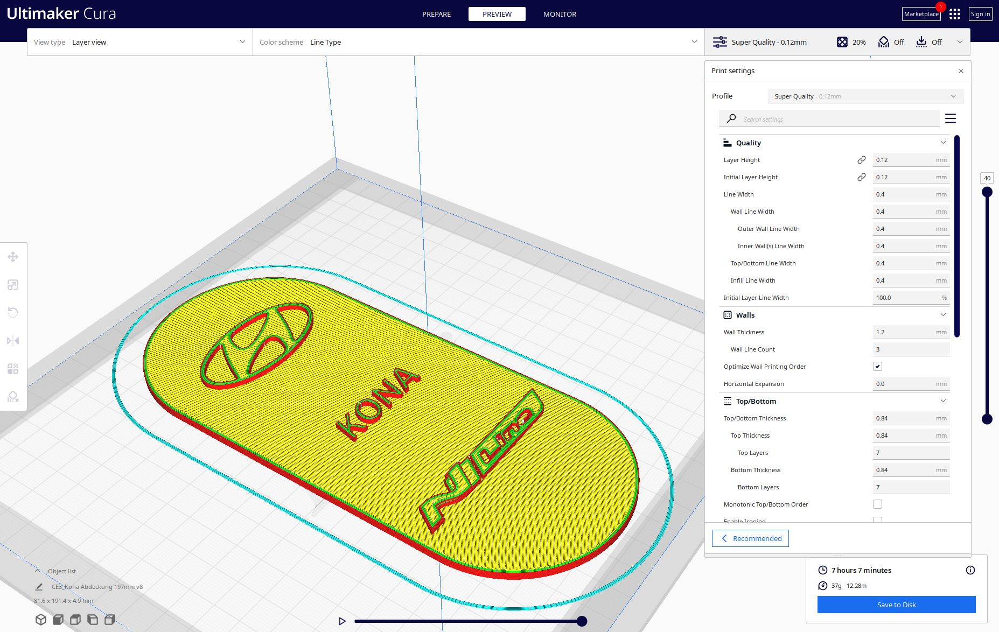

# Die Rolle von CAD-Software im 3D-Druck: Wie digitale Modelle Realität werden

Der 3D-Druck hat das Potenzial, nahezu jede Idee in die Realität umzusetzen, aber dieser Prozess beginnt nicht erst beim Drucker. Der erste und wichtigste Schritt ist die Erstellung eines digitalen Modells, und hier kommt CAD-Software (Computer-Aided Design) ins Spiel. In diesem Artikel beleuchten wir die Rolle von CAD-Software im 3D-Druck, zeigen, wie digitale Modelle erstellt werden, und geben Tipps, wie Sie Ihre Designs für den Druck optimieren können.

## 1. Was ist CAD-Software?

CAD-Software ist ein Werkzeug, das Ingenieuren, Designern und Architekten ermöglicht, präzise technische Zeichnungen und Modelle in einer digitalen Umgebung zu erstellen. Diese Software ist essenziell für den 3D-Druck, da sie die Grundlage für die Druckdateien bildet, die an den Drucker gesendet werden.

### Wichtige Merkmale von CAD-Software:

- **Präzision:** CAD-Programme ermöglichen die Erstellung extrem genauer Modelle, die bis ins kleinste Detail spezifiziert werden können.
- **3D-Modellierung:** Mit CAD-Software können komplexe 3D-Objekte entworfen und aus verschiedenen Perspektiven visualisiert werden.
- **Bearbeitungsfunktionen:** CAD-Software bietet leistungsstarke Tools zum Ändern, Anpassen und Optimieren von Designs.

## 2. Der Workflow: Vom CAD-Modell zum 3D-Druck

Der Prozess, ein CAD-Modell in ein physisches Objekt umzuwandeln, besteht aus mehreren Schritten, die sorgfältig aufeinander abgestimmt sein müssen.

### Schritt 1: Erstellung des 3D-Modells

Der erste Schritt im Workflow ist die Erstellung eines digitalen 3D-Modells. Dies kann von Grund auf neu erfolgen oder durch das Importieren und Modifizieren bestehender Modelle.

- **Beispiel:** Ein Ingenieur entwirft ein Zahnrad in einer CAD-Software wie AutoCAD oder Fusion 360, indem er präzise Maße und Formen angibt.

### Schritt 2: Exportieren des Modells als STL-Datei

Sobald das Modell fertig ist, wird es in ein Format exportiert, das vom 3D-Drucker gelesen werden kann. Das gängigste Format hierfür ist STL (Standard Tessellation Language).

- **Beispiel:** Das Zahnrad wird als STL-Datei exportiert, die die Oberfläche des 3D-Modells in einer Serie von Dreiecken darstellt.

### Schritt 3: Slicing des Modells

Bevor das Modell gedruckt werden kann, muss es „gesliced“ werden, d. h., es wird in dünne Schichten aufgeteilt, die der Drucker dann Schritt für Schritt aufträgt. Dies geschieht mit spezieller Slicing-Software wie Cura oder PrusaSlicer.

- **Beispiel:** Die STL-Datei wird in die Slicing-Software geladen, wo Parameter wie Schichthöhe, Füllmuster und Druckgeschwindigkeit festgelegt werden.

### Schritt 4: Druckvorbereitung und Optimierung

Nach dem Slicing wird der G-Code, der das Druckermodell steuert, generiert und an den Drucker gesendet. Vor dem Druck kann es notwendig sein, das Modell weiter zu optimieren, um die bestmögliche Qualität zu gewährleisten.

- **Beispiel:** Der Ingenieur überprüft die Vorschau des Drucks, um sicherzustellen, dass keine Überhänge ohne Stützen vorhanden sind und dass das Objekt optimal ausgerichtet ist.

_Das Slicing eines 3D-Modells in der Slicing-Software Cura._

## 3. Optimierung von CAD-Modellen für den 3D-Druck

Nicht jedes CAD-Modell ist automatisch für den 3D-Druck geeignet. Es gibt einige wichtige Aspekte, die beim Design berücksichtigt werden müssen, um sicherzustellen, dass das Modell erfolgreich gedruckt werden kann.

### Wandstärken und Details

Wandstärken spielen eine entscheidende Rolle für die Stabilität und Druckbarkeit eines Modells. Zu dünne Wände können brechen, während zu dicke Wände den Materialverbrauch unnötig erhöhen.

- **Tipp:** Halten Sie Wandstärken von mindestens 1,2 mm ein, um eine ausreichende Stabilität zu gewährleisten.

### Überhänge und Stützen

Überhänge, die in einem Winkel von mehr als 45 Grad gedruckt werden, benötigen in der Regel Stützen, um zu verhindern, dass das Material in der Luft hängt und abfällt.

- **Tipp:** Reduzieren Sie Überhänge oder integrieren Sie sie in das Design, um den Bedarf an Stützen zu minimieren.

### Füllmuster und Infill

Das Füllmuster (Infill) beeinflusst die Festigkeit und das Gewicht des gedruckten Objekts. CAD-Modelle sollten so entworfen werden, dass sie ein effektives Füllmuster unterstützen.

- **Tipp:** Verwenden Sie Gitter- oder Wabenmuster für ein gutes Verhältnis zwischen Festigkeit und Materialeinsparung.

## 4. Beliebte CAD-Programme für den 3D-Druck

Es gibt eine Vielzahl von CAD-Programmen, die sich für den 3D-Druck eignen. Hier sind einige der beliebtesten und leistungsfähigsten Tools:

### AutoCAD

AutoCAD ist eine der bekanntesten CAD-Softwarelösungen und wird in vielen Branchen eingesetzt. Es bietet umfassende 2D- und 3D-Modellierungswerkzeuge und ist besonders für technische Zeichnungen geeignet.

### Fusion 360

Fusion 360 von Autodesk ist eine cloudbasierte CAD-Software, die sowohl für Einsteiger als auch für Profis geeignet ist. Es kombiniert CAD, CAM und CAE in einer einzigen Plattform und bietet Tools zur Modellierung, Simulation und Fertigung.

### Tinkercad

Tinkercad ist eine einfach zu bedienende, webbasierte CAD-Software, die sich ideal für Einsteiger eignet. Es bietet grundlegende Modellierungsfunktionen und ist perfekt für einfache 3D-Druckprojekte.

## Fazit: CAD-Software als Schlüssel zum erfolgreichen 3D-Druck

CAD-Software ist ein unverzichtbares Werkzeug im 3D-Druckprozess. Sie ermöglicht die präzise Erstellung digitaler Modelle, die dann in physische Objekte umgewandelt werden können. Durch das Verständnis der Funktionen und Möglichkeiten von CAD-Software können Sie Ihre 3D-Druckprojekte optimieren und erfolgreich umsetzen.
