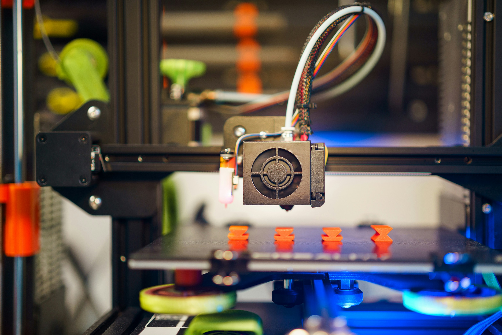

# Feinabstimmung der Druckgeschwindigkeit: So finden Sie die optimale Balance zwischen Qualität und Geschwindigkeit

Die Druckgeschwindigkeit ist ein kritischer Faktor im 3D-Druck, der sowohl die Qualität als auch die Zeit, die für die Fertigstellung eines Drucks benötigt wird, beeinflusst. Die richtige Balance zwischen Druckgeschwindigkeit und Qualität zu finden, kann jedoch eine Herausforderung sein. In diesem Artikel zeigen wir Ihnen detailliert, wie Sie die Druckgeschwindigkeit optimal einstellen, um sowohl qualitativ hochwertige Drucke als auch effiziente Druckzeiten zu erzielen.

## 1. Warum die Druckgeschwindigkeit wichtig ist

Die Druckgeschwindigkeit beeinflusst direkt die Zeit, die benötigt wird, um ein Objekt zu drucken, sowie die Oberflächenqualität und die strukturelle Integrität des gedruckten Teils. Eine zu hohe Geschwindigkeit kann zu schlechterer Druckqualität, ungenauen Details und mechanischen Problemen führen, während eine zu niedrige Geschwindigkeit die Druckzeit erheblich verlängern kann.

### Einfluss der Druckgeschwindigkeit auf die Druckqualität:

- **Hohe Geschwindigkeit:** Kann zu ungenauen Details, schlechter Haftung und ungleichmäßiger Extrusion führen.
- **Niedrige Geschwindigkeit:** Führt zu präziseren Details, besserer Schichthaftung und höherer Oberflächenqualität.

## 2. Optimale Druckgeschwindigkeit für verschiedene Materialien

Verschiedene 3D-Druckmaterialien erfordern unterschiedliche Druckgeschwindigkeiten, um die besten Ergebnisse zu erzielen. Hier sind einige Richtwerte für gängige Materialien:

| Material  | Empfohlene Druckgeschwindigkeit | Eigenschaften                                         |
| --------- | ------------------------------- | ----------------------------------------------------- |
| **PLA**   | 40-60 mm/s                      | Einfach zu drucken, geringe Verzugsneigung            |
| **ABS**   | 30-50 mm/s                      | Neigt zu Verzug, erfordert langsamere Geschwindigkeit |
| **PETG**  | 30-60 mm/s                      | Starke Haftung, moderate Geschwindigkeit empfohlen    |
| **TPU**   | 20-40 mm/s                      | Flexibel, erfordert langsame Druckgeschwindigkeit     |
| **Nylon** | 30-50 mm/s                      | Hohe Festigkeit, moderate Geschwindigkeit empfohlen   |

## 3. Techniken zur Feinabstimmung der Druckgeschwindigkeit

Die optimale Druckgeschwindigkeit hängt nicht nur vom Material, sondern auch von der Komplexität des Drucks und der spezifischen Druckerhardware ab. Hier sind einige Techniken, um die Geschwindigkeit fein abzustimmen:

### Anpassung der Geschwindigkeit für verschiedene Druckabschnitte

Komplexe Drucke können von variablen Geschwindigkeiten profitieren. Sie können die Geschwindigkeit in bestimmten Bereichen des Drucks reduzieren, um die Qualität zu verbessern, und sie in weniger kritischen Bereichen erhöhen, um Zeit zu sparen.

- **Perimeter:** Reduzieren Sie die Geschwindigkeit der äußeren Schichten (z. B. 30-40 mm/s), um eine bessere Oberflächenqualität zu erzielen.
- **Infill:** Erhöhen Sie die Geschwindigkeit des Infill-Bereichs (z. B. 60-80 mm/s), da die Oberflächenqualität hier weniger kritisch ist.

### Kalibrierung der Beschleunigungs- und Jerk-Einstellungen

Beschleunigung und Jerk beeinflussen, wie schnell der Druckkopf die volle Druckgeschwindigkeit erreicht und wie abrupt Richtungsänderungen vorgenommen werden. Durch die Anpassung dieser Parameter können Sie Vibrationen und mechanische Belastungen reduzieren.

- **Beschleunigung:** Reduzieren Sie die Beschleunigungseinstellungen, um glattere Bewegungen und bessere Druckqualität zu erzielen.
- **Jerk:** Niedrigere Jerk-Einstellungen können helfen, plötzliche Bewegungen zu vermeiden, die die Druckqualität beeinträchtigen.

```plaintext
M204 P500 T1000 ; Setzt die Beschleunigung auf 500 mm/s² für Druck und 1000 mm/s² für Reisen
M205 X8 Y8 ; Setzt den Jerk-Wert auf 8 mm/s
```

### Testdrucke und Geschwindigkeitstests

Testdrucke sind eine hervorragende Methode, um die optimale Druckgeschwindigkeit für Ihr spezifisches Setup zu ermitteln. Drucken Sie einfache Testmodelle mit unterschiedlichen Geschwindigkeiten und vergleichen Sie die Ergebnisse.


_Testdrucke, die mit unterschiedlichen Geschwindigkeiten gedruckt wurden, um die optimale Balance zwischen Qualität und Geschwindigkeit zu finden._

## 4. Fehlerbehebung bei Geschwindigkeitsproblemen

Manchmal kann die Anpassung der Druckgeschwindigkeit unerwünschte Nebenwirkungen haben. Hier sind einige häufige Probleme und deren Lösungen:

### Problem: Schichtverschiebungen bei hoher Geschwindigkeit

- **Ursache:** Zu hohe Geschwindigkeit kann dazu führen, dass der Drucker mechanische Grenzen überschreitet.
- **Lösung:** Reduzieren Sie die Geschwindigkeit oder überprüfen Sie die mechanischen Komponenten auf Lockerheit oder Verschleiß.

### Problem: Stringing bei zu schneller Extrusion

- **Ursache:** Zu hohe Geschwindigkeit in Kombination mit unzureichender Retraktion kann zu Fädenbildung führen.
- **Lösung:** Verringern Sie die Druckgeschwindigkeit und erhöhen Sie die Retraktionseinstellungen.

### Problem: Überhitzung des Druckobjekts

- **Ursache:** Zu langsame Geschwindigkeit kann dazu führen, dass das Objekt überhitzt, insbesondere bei kleinen Teilen.
- **Lösung:** Verwenden Sie zusätzliche Kühlung oder drucken Sie mehrere Objekte gleichzeitig, um die Wärmeverteilung zu verbessern.

## Fazit: Finden Sie die perfekte Balance für Ihre Drucke

Die Feinabstimmung der Druckgeschwindigkeit ist ein wichtiger Schritt, um die Balance zwischen Druckqualität und Geschwindigkeit zu optimieren. Durch das Verständnis der Materialien, die Anpassung der Druckparameter und die Durchführung von Testdrucken können Sie die besten Ergebnisse erzielen und gleichzeitig die Druckzeit minimieren.
