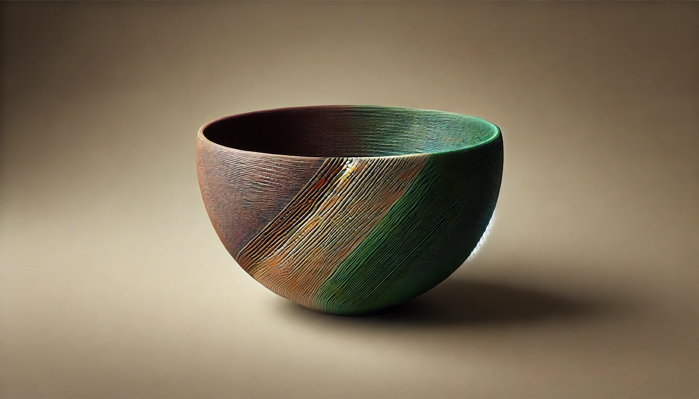

# Wie funktioniert Dual-Extrusion im 3D-Druck? Vorteile, Herausforderungen und Einsatzmöglichkeiten

Dual-Extrusion ist eine fortschrittliche Technologie im 3D-Druck, die es ermöglicht, zwei verschiedene Materialien oder Farben gleichzeitig zu drucken. Dies eröffnet zahlreiche neue Möglichkeiten für die Gestaltung von Objekten und die Erweiterung der Funktionalität von 3D-Druckern. In diesem Artikel erklären wir detailliert, wie Dual-Extrusion funktioniert, welche Vorteile und Herausforderungen diese Technologie mit sich bringt und welche Einsatzmöglichkeiten sie bietet.

## 1. Was ist Dual-Extrusion?

Dual-Extrusion bezieht sich auf den Einsatz von zwei Extrudern in einem 3D-Drucker. Diese beiden Extruder können entweder zwei verschiedene Filamente (Materialien) oder zwei verschiedene Farben desselben Filaments verarbeiten. Dies ermöglicht den Druck von komplexeren Modellen, die mit einem einzigen Extruder nicht möglich wären.

### Aufbau und Funktionsweise:

- **Zwei Extruder:** Der Drucker verfügt über zwei separate Extruder, die unabhängig voneinander arbeiten. Jeder Extruder ist mit einem eigenen Filament versehen.
- **Düsensteuerung:** Der Druckkopf bewegt sich wie bei einem herkömmlichen Drucker, jedoch mit der zusätzlichen Fähigkeit, zwischen den beiden Düsen zu wechseln, um unterschiedliche Materialien oder Farben aufzutragen.
- **G-Code-Anpassung:** Der G-Code, der den Drucker steuert, wird so programmiert, dass er die richtige Düse zur richtigen Zeit aktiviert, um das gewünschte Druckmuster zu erzeugen.

## 2. Vorteile der Dual-Extrusion

Die Verwendung von Dual-Extrusion bietet mehrere wesentliche Vorteile, die den 3D-Druck vielseitiger und effizienter machen.

### Mehrfarbige Drucke

Mit Dual-Extrusion können Sie mehrfarbige Objekte in einem einzigen Druckvorgang erstellen, ohne dass ein aufwendiger Farbwechsel erforderlich ist. Dies ist besonders nützlich für Modelle, die visuell ansprechender oder funktionaler sein sollen.

- **Beispiel:** Ein Spielzeugmodell mit integrierten, farbigen Details oder ein Firmenlogo, das in zwei Farben gedruckt wird.

### Kombinierte Materialien

Ein weiterer großer Vorteil der Dual-Extrusion ist die Möglichkeit, zwei unterschiedliche Materialien in einem Druck zu kombinieren. Beispielsweise können Sie ein festes Material für den Hauptkörper eines Objekts und ein flexibles Material für bestimmte Teile verwenden.

- **Beispiel:** Ein Hartplastikgehäuse mit eingebauten Gummidichtungen oder Stoßdämpfern.

### Verwendung von löslichen Stützstrukturen

Dual-Extrusion ermöglicht die Verwendung von löslichem Filament, wie PVA, für Stützstrukturen. Diese Stützen können nach dem Druck einfach in Wasser aufgelöst werden, was den Nachbearbeitungsaufwand erheblich reduziert und komplexere Geometrien ermöglicht.

- **Beispiel:** Ein komplexes mechanisches Teil mit überhängenden Strukturen, die durch lösliche Stützen unterstützt werden.

## 3. Herausforderungen der Dual-Extrusion

Trotz ihrer Vorteile bringt die Dual-Extrusion auch einige Herausforderungen mit sich, die bei der Verwendung dieser Technologie berücksichtigt werden müssen.

### Kalibrierung und Ausrichtung

Die präzise Ausrichtung der beiden Düsen ist entscheidend für die Qualität des Drucks. Eine falsche Kalibrierung kann zu Versatzfehlern führen, bei denen die beiden Materialien nicht korrekt aufeinander abgestimmt sind.

- **Lösung:** Regelmäßige Kalibrierung und Tests zur Sicherstellung der genauen Ausrichtung der Düsen.

### Materialkompatibilität

Nicht alle Materialien lassen sich gut miteinander kombinieren. Unterschiedliche Drucktemperaturen und Haftungseigenschaften können zu Problemen führen, wenn zwei verschiedene Materialien verwendet werden.

- **Lösung:** Verwenden Sie kompatible Materialien und führen Sie Tests durch, um sicherzustellen, dass die Drucke den gewünschten Anforderungen entsprechen.

### Erhöhte Druckzeit

Das Drucken mit zwei Materialien kann die Druckzeit verlängern, da der Drucker zwischen den Düsen wechseln und möglicherweise langsamere Geschwindigkeiten verwenden muss, um die Präzision zu gewährleisten.

- **Lösung:** Planen Sie zusätzliche Druckzeit ein und optimieren Sie den G-Code, um die Effizienz zu maximieren.

## 4. Einsatzmöglichkeiten der Dual-Extrusion

Die Möglichkeiten, die Dual-Extrusion bietet, sind vielfältig und erweitern die Anwendungsbereiche des 3D-Drucks erheblich.

### Funktionale Prototypen

Dual-Extrusion ermöglicht die Herstellung von Prototypen, die verschiedene Materialeigenschaften in einem einzigen Druck kombinieren. Dies ist besonders nützlich für die Entwicklung von Produkten, die sowohl flexible als auch starre Komponenten enthalten.

- **Beispiel:** Ein Prototyp eines Wearables, bei dem das Gehäuse aus hartem Kunststoff besteht und die Bänder aus flexiblem TPU gedruckt werden.

### Kunst und Design

Künstler und Designer nutzen Dual-Extrusion, um komplexe und mehrfarbige Modelle zu erstellen, die mit herkömmlichen Drucktechniken nicht möglich wären.

- **Beispiel:** Eine Skulptur mit detaillierten farbigen Elementen, die in einem einzigen Druckvorgang realisiert werden.

_Eine 3D-gedruckte Schale, welche mit Dual-Extrusion in zwei Farben erstellt wurde._

### Technische Anwendungen

In der Technik und im Maschinenbau ermöglicht Dual-Extrusion die Fertigung von Bauteilen, die unterschiedliche mechanische Eigenschaften in einem Teil kombinieren, z. B. harte und flexible Segmente.

- **Beispiel:** Dichtungen, die aus einem harten Rahmen und einer weichen, flexiblen Dichtung bestehen.

## Fazit: Dual-Extrusion als vielseitiges Werkzeug im 3D-Druck

Dual-Extrusion erweitert die Möglichkeiten des 3D-Drucks erheblich, indem sie das Drucken mit mehreren Farben oder Materialien in einem einzigen Durchgang ermöglicht. Obwohl diese Technologie einige Herausforderungen mit sich bringt, überwiegen die Vorteile, insbesondere für komplexe und multifunktionale Projekte. Mit der richtigen Kalibrierung und Materialwahl können Sie die Potenziale der Dual-Extrusion voll ausschöpfen und innovative, hochwertige Drucke erstellen.
