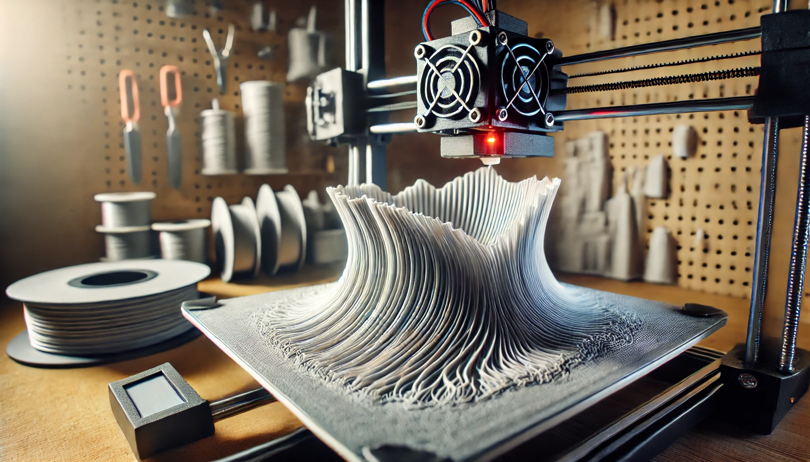

Der 3D-Druck bietet beeindruckende Möglichkeiten, aber wie jede Technologie hat auch er seine Tücken. Druckfehler können frustrierend sein, besonders wenn Sie nicht wissen, wie Sie diese beheben können. In diesem Artikel werfen wir einen Blick auf die häufigsten 3D-Druckprobleme und zeigen Ihnen, wie Sie diese effizient lösen können, um bessere Druckergebnisse zu erzielen.

## 1. Warping: Wenn sich das Druckobjekt von der Bauplatte löst

Warping tritt auf, wenn sich die Ecken oder Ränder eines Druckobjekts während des Drucks von der Bauplatte lösen und nach oben biegen. Dies kann zu deformierten und unbrauchbaren Teilen führen.

### Ursachen und Lösungen für Warping:

- **Ursache:** Ungleichmäßige Abkühlung des Materials, was zu Spannungen führt.
- **Lösung:** Verwenden Sie ein beheiztes Druckbett und stellen Sie sicher, dass es auf die richtige Temperatur eingestellt ist. Eine gute Haftung auf der Bauplatte kann durch den Einsatz von Klebestiften, Blue Tape oder speziellen Haftfolien verbessert werden.

_Ein 3D-Druckobjekt mit Warping-Problemen an den Rändern._

## 2. Stringing: Ungewollte Fäden zwischen den Teilen

Stringing, auch Fädenbildung genannt, tritt auf, wenn dünne Fäden aus dem Druckkopf herausgezogen werden und zwischen verschiedenen Teilen des Drucks hängen.

### Ursachen und Lösungen für Stringing:

- **Ursache:** Zu hohe Drucktemperatur oder unzureichende Retraktionseinstellungen.
- **Lösung:** Reduzieren Sie die Drucktemperatur und erhöhen Sie die Retraktionsdistanz und -geschwindigkeit in Ihren Druckeinstellungen. Testen Sie verschiedene Einstellungen, um die optimale Balance zu finden.

## 3. Schichtverschiebung: Versetzte Schichten im Druckobjekt

Schichtverschiebung tritt auf, wenn die Schichten eines Drucks nicht exakt aufeinander ausgerichtet sind, wodurch das Objekt verzerrt oder verdreht wird.

### Ursachen und Lösungen für Schichtverschiebung:

- **Ursache:** Mechanische Probleme wie lose Riemen, blockierte Achsen oder zu hohe Druckgeschwindigkeit.
- **Lösung:** Überprüfen Sie alle mechanischen Komponenten des Druckers, einschließlich der Riemen und Führungen. Reduzieren Sie die Druckgeschwindigkeit und stellen Sie sicher, dass die Achsen frei von Hindernissen sind.

## 4. Unterextrusion: Unvollständige oder schwache Druckteile

Unterextrusion bedeutet, dass der Drucker nicht genügend Filament extrudiert, was zu schwachen oder lückenhaften Teilen führt.

### Ursachen und Lösungen für Unterextrusion:

- **Ursache:** Verstopfte Düse, falsche Filamentdurchmesser-Einstellungen oder zu niedrige Extrusionstemperatur.
- **Lösung:** Überprüfen und reinigen Sie die Düse, stellen Sie sicher, dass der Filamentdurchmesser in der Slicer-Software korrekt eingestellt ist, und erhöhen Sie die Extrusionstemperatur, falls erforderlich.

## 5. Overextrusion: Zu viel Material wird extrudiert

Overextrusion tritt auf, wenn der Drucker zu viel Filament extrudiert, was zu überstehenden Schichten und einer ungleichmäßigen Oberfläche führt.

### Ursachen und Lösungen für Overextrusion:

- **Ursache:** Zu hohe Extrusionseinstellungen oder falscher Filamentdurchmesser.
- **Lösung:** Reduzieren Sie den Flusswert in der Slicer-Software und überprüfen Sie den Filamentdurchmesser. Eine Reduzierung der Extrusionstemperatur kann ebenfalls hilfreich sein.

## 6. Fehlende erste Schicht: Probleme beim Start des Drucks

Wenn die erste Schicht nicht richtig haftet oder unvollständig ist, kann dies den gesamten Druck ruinieren.

### Ursachen und Lösungen für eine fehlende erste Schicht:

- **Ursache:** Druckbett nicht richtig nivelliert, falsche Druckbett-Temperatur oder ungeeignete Druckgeschwindigkeit.
- **Lösung:** Nivellieren Sie das Druckbett sorgfältig, erhöhen Sie die Druckbetttemperatur und passen Sie die Druckgeschwindigkeit für die erste Schicht an. Ein langsamerer Druckstart hilft oft, eine stabile Basis zu schaffen.

## 7. Blasen und Hohlräume: Unebenheiten in den Druckschichten

Blasen oder Hohlräume im Druck können die Festigkeit und das Aussehen des Drucks beeinträchtigen.

### Ursachen und Lösungen für Blasen und Hohlräume:

- **Ursache:** Feuchtigkeit im Filament oder falsche Drucktemperatur.
- **Lösung:** Lagern Sie das Filament in einer trockenen Umgebung oder verwenden Sie einen Trockenbehälter. Passen Sie die Drucktemperatur an, um sicherzustellen, dass das Filament gleichmäßig schmilzt.

## 8. Fazit: So vermeiden Sie Druckfehler und verbessern Ihre Ergebnisse

3D-Druck ist ein Prozess, der durch Geduld und Feintuning perfektioniert wird. Indem Sie die häufigsten Druckprobleme verstehen und die richtigen Maßnahmen ergreifen, können Sie Ihre Druckergebnisse erheblich verbessern. Denken Sie daran, dass die meisten Probleme durch einfache Anpassungen an den Druckeinstellungen oder die Wartung des Druckers gelöst werden können.
